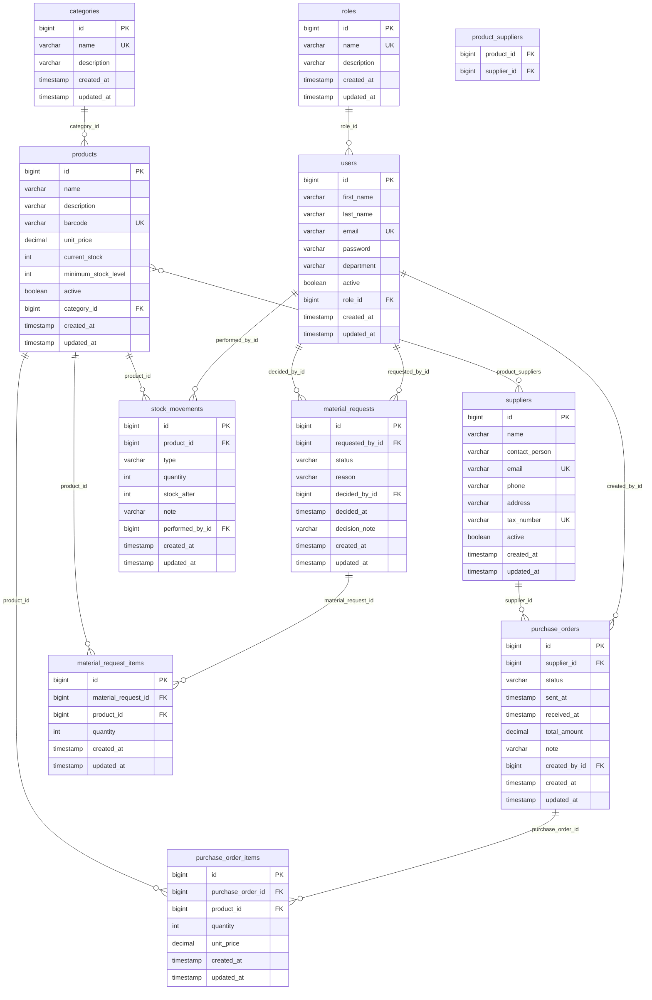

# Veritabanı ER Diyagramı

Aşağıdaki diyagram `inventory-management` projesinin tüm veritabanı tablolarını ve aralarındaki ilişkileri göstermektedir.

## Tablo Açıklamaları

| Tablo | Açıklama |
|---|---|
| `roles` | Kullanıcı rolleri (ADMIN, USER vb.) |
| `users` | Sisteme giriş yapan kullanıcılar |
| `categories` | Ürün kategorileri |
| `suppliers` | Tedarikçiler |
| `products` | Ürün kataloğu ve stok bilgileri |
| `product_suppliers` | Ürün–tedarikçi çoka-çok ilişkisi |
| `purchase_orders` | Tedarikçiye verilen satın alma siparişleri |
| `purchase_order_items` | Sipariş kalemleri |
| `material_requests` | Kullanıcıların oluşturduğu malzeme talepleri |
| `material_request_items` | Talep kalemleri |
| `stock_movements` | Stok giriş / çıkış / düzeltme hareketleri |
